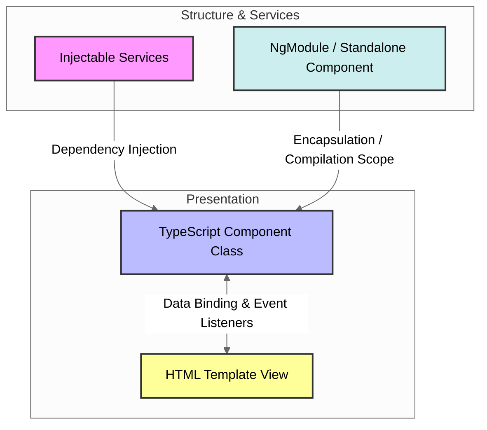
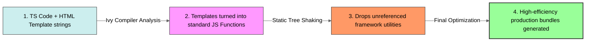

```mermaid
%%{init: {'theme': 'neutral', 'themeVariables': { 'textColor': '#000000', 'edgeLabelBackground': '#FFFFFF' }}}%%
graph TD
    subgraph Modular Layer [Structure & Services]
        Module[NgModule / Standalone Component]
        Service[Injectable Services]
    end

    subgraph View Layer [Presentation]
        Template[HTML Template View]
        Component[TypeScript Component Class]
    end

    %% Architectural Bindings
    Component <-->|Data Binding & Event Listeners| Template
    Service -->|Dependency Injection| Component
    Module -->|Encapsulation / Compilation Scope| Component

    style Module fill:#cee,stroke:#333,stroke-width:2px
    style Service fill:#f9f,stroke:#333,stroke-width:2px
    style Component fill:#bbf,stroke:#333,stroke-width:2px
    style Template fill:#ff9,stroke:#333,stroke-width:2px

```

```mermaid
%%{init: {'theme': 'neutral', 'themeVariables': { 'textColor': '#000000', 'edgeLabelBackground': '#FFFFFF' }}}%%
graph LR
    Source[1. TS Code + HTML Template strings] -->|Ivy Compiler Analysis| Templates[2. Templates turned into standard JS Functions]
    Templates -->|Static Tree Shaking| DeadCode[3. Drops unreferenced framework utilities]
    DeadCode -->|Final Optimization| Bundle[4. High-efficiency production bundles generated]

    style Source fill:#cee,stroke:#333,stroke-width:1px
    style Templates fill:#f9f,stroke:#333,stroke-width:1px
    style DeadCode fill:#f96,stroke:#333,stroke-width:1px
    style Bundle fill:#9f9,stroke:#333,stroke-width:2px

```